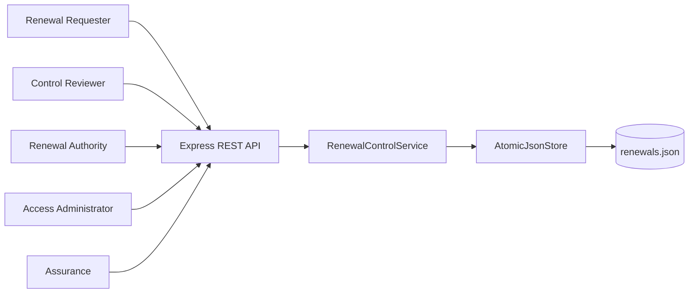
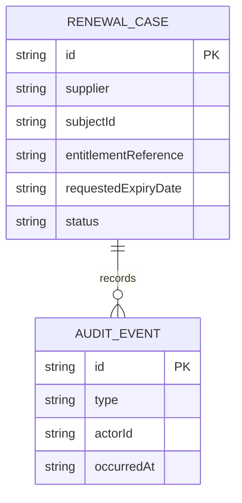
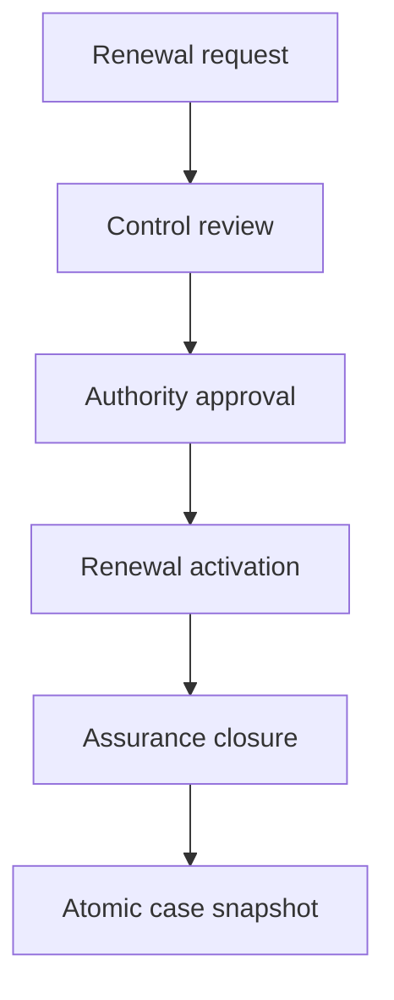
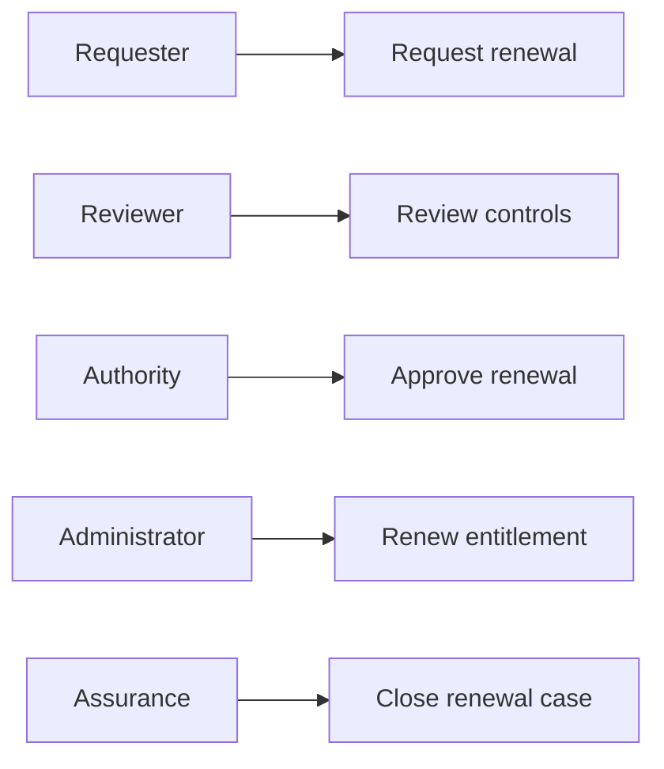
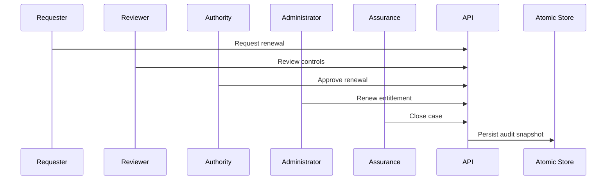

# Supplier Evidence Access Renewal Control Platform

## The Problem

Supplier evidence access renewals can become routine approvals without a connected record of continuing need, control review, authority decision, technical renewal, and assurance confirmation. This weakens the ability to demonstrate that long-running access remains properly governed.

## The Solution

This service governs renewals through request, control review, authority approval, administrative renewal activation, and assurance closure. Each action requires its assigned role and predecessor state, adds an audit event, and atomically persists the case.

## Live Demo and Tech Stack

Start the service and visit `http://localhost:64200/health` to confirm readiness. The stack uses Node.js 22, Express 5, ESM JavaScript, atomic JSON persistence, Vitest, and GitHub Actions.

| Layer | Implementation | Responsibility |
| --- | --- | --- |
| HTTP API | Express 5 | Renewal lifecycle routes and errors |
| Control domain | ESM JavaScript | Role gates, state progression, and audits |
| Persistence | Node file system | Temporary snapshot and atomic rename |
| Verification | Vitest and GitHub Actions | Tests and continuous integration |

## Local Setup and Run Instructions

```bash
git clone https://github.com/kholipha-ahmmad-al-amin/supplier-evidence-access-renewal-control-platform.git
cd supplier-evidence-access-renewal-control-platform
npm install
npm test
npm start
```

The service binds to `0.0.0.0:64200` for approved local area network use.

## System Documentation

### System Architecture Diagram


### Entity-Relationship Diagram


### Data Flow Diagram


### Use Case Diagram


### Sequence Diagram


## Owner

Created and maintained by Kholipha Ahmmad Al-Amin.

Software Engineer and AI Specialist

Founder and CEO of EquiSaaS BD

Principal Consultant at AR IT Consultancy

Full Stack Developer and SaaS Product Builder

### Official links

Portfolio: https://kholipha-ahmmad-al-amin.equisaas-bd.com/

GitHub: https://github.com/kholipha-ahmmad-al-amin

LinkedIn: https://www.linkedin.com/in/kholipha-ahmmad-al-amin

X: https://x.com/al_amin5519

Facebook: https://www.facebook.com/kholipha.ahmmad.al.amin

Instagram: https://www.instagram.com/kholipha.ahmmad.al.amin

## Ownership

This project was created and is maintained by Kholipha Ahmmad Al-Amin.
